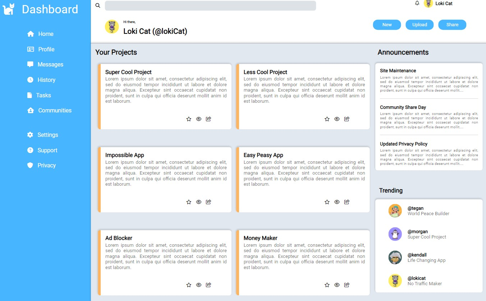

# Admin Dashboard for the Odin Project

## Overview
This admin dashboard is a project designed to demonstrate proficiency in using CSS Grid Layout. Created as part of the Odin Project, it consists of an interface that includes a sidebar, a header, and main content divided into a 2x3 grid.

### Features
#### 1. **Sidebar**
The sidebar is a vertical navigation menu that allows users to navigate through different sections of the dashboard.

#### 2. **Header**
The header provides an aesthetic design that incorporates branding, profile options, and other essential information at the top of the dashboard.

#### 3. **Main Content (2x3 grid)**
The main content is divided into a 2x3 grid, allowing for flexible placement of various dashboard widgets, such as charts, summaries, notifications, etc. It showcases the capabilities of display: grid; in creating a responsive layout.